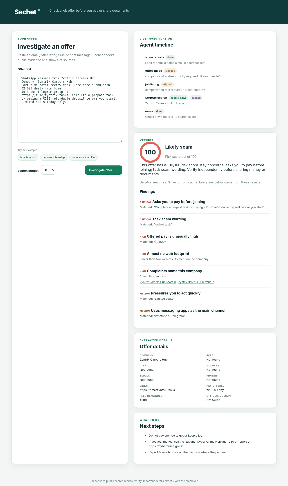

# Sachet

**Check a job or internship offer before you pay or share documents.**

Sachet (Hindi for "alert") is an AI agent for Indian students and job seekers. Paste an offer
letter, a recruiter email, an SMS or a WhatsApp message. Sachet pulls out the company, role,
recruiter contacts, pay and any fee it asks for, plans an investigation, runs live searches
through [SerpApi](https://serpapi.com), changes its plan based on what it finds, and returns a
verdict with a 0 to 100 risk score. Every finding shows the search results it is based on, and
every link in a report came from a SerpApi response during that run.

Built for the SerpApi India Hackathon 2026, AI Agents track.



## Why this exists

Fake job and internship offers are one of the most common scams aimed at Indian students:
"registration fees" for a seat, "refundable" background check deposits, hotel review task jobs
on Telegram, and offer letters sent from domains that imitate a real employer. The warning signs
are usually findable on the open web (the company's real domain, its own fraud advisory, earlier
complaints, whether the role is listed anywhere, whether the office exists), but a nervous fresher
with an offer that "expires today" rarely checks all of them. Sachet does that legwork in under a
minute and explains what it found.

## What the agent does

```
offer text
   |
   v
extract entities (rules, optional LLM refine) -> company, role, city, emails, links, phones, pay, fees
   |
   v
text rules (free, no search)  -> fee demands, task-scam wording, OTP requests, no interview, urgency
   |
   v
plan: footprint -> domain check -> complaints -> contact trace -> office -> job listing -> news
   |      ^
   |      +-- re-plan after every step:
   |          * official domain found and recruiter domain imitates it -> probe that domain
   |          * official site not found -> probe the recruiter's own domain
   |          * no web footprint, or a big brand that scammers impersonate -> trace contacts first
   |          * company missing -> derive it from the recruiter's corporate domain
   v
optional LLM follow-up (tool calling on the same SerpApi tools, capped by the search budget,
uncited or unverifiable findings are dropped, can never raise a "critical" finding)
   |
   v
deterministic score + verdict + India-specific next steps (1930 helpline, cybercrime.gov.in)
```

The verdict is computed by explainable rules, not by the language model. The model can only add
findings that cite URLs Sachet actually saw in SerpApi results.

## How it uses SerpApi

SerpApi is the evidence layer: without live search results Sachet can only read the message
text. Searches go through the official
[`serpapi-search-tools`](https://serpapi.github.io/serpapi-search-tools-python/) package
(function provider, JSON mode) with a custom budgeted client, plus the `serpapi` SDK for Google
Jobs.

| Check | SerpApi engine | Why it matters |
|---|---|---|
| Company footprint | Google Search (`web_search`) | Knowledge graph, official website, registry mirrors (MCA records), and the company's own recruitment fraud advisory, which often names its real mail domain |
| Domain consistency | uses the footprint result | Flags recruiter domains that imitate the official domain (`infosys-hrdesk.in` vs `infosys.com`) |
| Complaints | Google Search | Consumer complaint sites, Reddit, Quora threads that name the company |
| Contact trace | Google Search | Whether the recruiter's phone number or free-mail address appears in scam reports |
| Suspicious domain probe | Google Search | Re-planned step: does the recruiter's domain have any independent presence |
| Office check | Google Maps (`maps_search`) | Is there a real listing for the company in the stated city, with rating and reviews |
| Role check | Google Jobs | Is the role publicly listed, and is the offered pay far above listed salaries |
| News | Google News (`news_search`) | Recent reports of job rackets using this company's name |

Budget and credit care: each investigation has a search budget (default 8, free plan friendly).
Responses are cached on disk, so re-running the same offer costs nothing, and runs can be
recorded and replayed offline (`--record`, `--replay`).

## Setup

Requires Python 3.10 or newer and a SerpApi key. A free SerpApi account includes 250 searches
a month: <https://serpapi.com/users/sign_up>.

```bash
git clone https://github.com/Arun07AK/sachet.git
cd sachet
python -m venv .venv && source .venv/bin/activate
pip install -e ".[dev]"
cp .env.example .env          # then put your key in SERPAPI_API_KEY
```

### Web app

```bash
sachet serve                  # open http://127.0.0.1:8000
```

Paste an offer or click an example, pick a search budget, and press Investigate. The timeline
streams each agent step and each SerpApi search as it happens, then the verdict card shows the
score, findings with sources, extracted details and next steps.

### Command line

```bash
sachet examples
sachet check examples/impersonation_offer.txt
sachet check examples/genuine_internship.txt --markdown
cat offer.txt | sachet check - --json --budget 5
```

### Offline replay (no key needed)

```bash
sachet check examples/fake_task_job.txt --replay tests/fixtures/synthetic
sachet serve --replay tests/fixtures/synthetic
```

`tests/fixtures/synthetic` holds hand-written fixtures in SerpApi's response shape for the test
suite. Use `--record DIR` on a live run to capture real responses and replay them later.

### Optional: LLM follow-up

Any OpenAI-compatible endpoint works (OpenAI, Groq, Gemini's OpenAI endpoint, OpenRouter, or a
local Ollama at `http://localhost:11434/v1`):

```bash
export SACHET_LLM_BASE_URL=https://api.openai.com/v1
export SACHET_LLM_API_KEY=...
export SACHET_LLM_MODEL=gpt-4o-mini
sachet check offer.txt --llm
```

### Optional: use it from Claude Desktop, Cursor or any MCP client

```bash
pip install -e ".[mcp]"
```

```json
{
  "mcpServers": {
    "sachet": {
      "command": "sachet-mcp",
      "env": { "SERPAPI_API_KEY": "your-key" }
    }
  }
}
```

The server exposes one tool, `verify_job_offer(text, budget)`, which returns the markdown report.

## Tests

```bash
pytest -q
ruff check src tests
```

The suite runs fully offline: extraction, red-flag rules, domain helpers, the budgeted gateway
(cache, budget, replay, key redaction, URL tracking), every check, planner re-planning, scoring,
the LLM loop with a mocked transport (including dropping uncited findings), the CLI, the streaming
web API and the MCP server registration.

## Project layout

```
src/sachet/
  extract.py     rule-based entity extraction (money, fees, phones, company, role, city)
  redflags.py    text-only warning signs
  domains.py     registrable domains, free mail, lookalike detection
  gateway.py     budgeted, cached, recordable SerpApi client (also the serpapi-search-tools client)
  tools.py       serpapi-search-tools wiring and LLM tool schemas
  checks.py      search-backed checks
  planner.py     adaptive investigation loop
  scoring.py     score, verdict, next steps
  llm.py         optional OpenAI-compatible follow-up agent
  web.py         FastAPI app with NDJSON streaming, static UI in static/
  cli.py         sachet check / serve / examples
  mcp_server.py  MCP tool
```

## Limitations

* Sachet is a second opinion, not a guarantee. A clean report does not prove an offer is real;
  always confirm through the employer's official careers page.
* Search results change over time and vary by region; small genuine startups can have a thin
  footprint, which Sachet reports as a signal, not a verdict.
* Entity extraction is rule based by default and can miss unusual formats; the optional LLM step
  fills gaps.

## AI tool disclosure

Built with AI assistance: OpenAI Codex CLI generated parts of the implementation from written
specs (kept in [docs/build-notes](docs/build-notes)), and an AI assistant helped with review,
tests, documentation and the demo video narration. All code was reviewed, tested and is
maintained by Arun AK.

## License

MIT, see [LICENSE](LICENSE).
